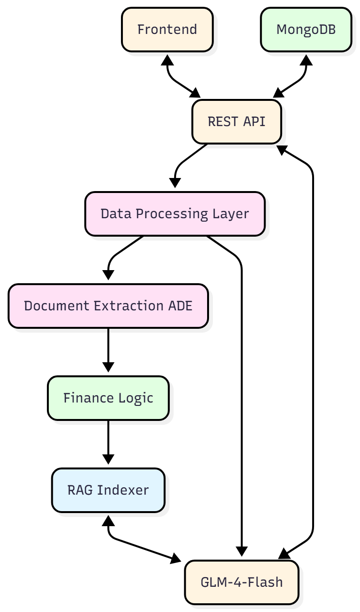

# Financial Advisor Agent 💳

**AI-Powered Credit Card Spending Analysis Assistant**

Financial Advisor Agent helps users analyze their credit card statements, understand spending patterns, and receive personalized financial advice. Built with AI-powered document extraction, hybrid RAG (Retrieval-Augmented Generation), and intelligent financial analysis to provide insights with full document citations.

> **⚠️ Important:** This tool **assists** users with financial analysis—it does **not** replace professional financial advice. All recommendations should be reviewed and verified. This is an analytical aid, not a financial advisory service.

---

## 🎬 Demo

[](https://www.youtube.com/watch?v=oqlkD0KvhY4)

> **Note:** Demo video includes all features as of November 10th, 2025
---

## 🎯 Use Cases We Cover

**What This Tool Does:**

1. **Credit Card Statement Analysis**
   - Extracts structured data (transactions, balances, payment dates, etc.)
   - Categorizes spending (dining, transportation, entertainment, housing, etc.)
   - Computes financial health scores and trends
   - Generates monthly spending reports

2. **Spending Pattern Analysis**
   - Identifies spending trends over time (weekly, monthly, quarterly)
   - Analyzes category-based spending patterns
   - Detects seasonal spending variations
   - Calculates spending volatility and stability metrics

3. **Financial Health Assessment**
   - Calculates financial health scores (0-100)
   - Evaluates balance management
   - Assesses payment consistency
   - Flags potential financial concerns

4. **Personalized Recommendations**
   - Budgeting recommendations based on spending patterns
   - Investment suggestions based on financial health
   - Debt management strategies
   - General financial wellness tips

5. **Interactive Q&A**
   - Ask questions about your spending in natural language
   - Get answers with citations from your statements
   - Hybrid RAG system (semantic + keyword search) for accurate retrieval
   - Context-aware responses using extracted data

**What This Tool Does NOT Do:**
- ❌ Provide professional financial or investment advice
- ❌ Replace certified financial advisors
- ❌ Guarantee financial outcomes
- ❌ Store sensitive financial data permanently (data is session-based)

---

## 🏗️ Architecture



*See [mermaidchart.md](./mermaidchart.md) for an alternative workflow diagram.*

The application follows a simple flow: **Upload → Extract → Index → Query → Analyze**

### Data Flow

**Upload Pipeline:**
1. User uploads credit card statement (PDF/image)
2. **LandingAI ADE** parses document to markdown
3. Structured data extraction using JSON schema (transactions, balances, dates)
4. Data normalization and transaction categorization
5. **Hybrid RAG indexing**: Document is chunked (1000 chars, 200 overlap) and embedded using sentence-transformers
6. Store in MongoDB: Document metadata, extracted data, and chat history

**Chat Pipeline (Hybrid RAG):**
1. User asks question (e.g., "What was my largest expense last month?")
2. **Hybrid Search**: 
   - Semantic search (70%): Cosine similarity using embeddings
   - Keyword search (30%): Term frequency matching
3. Retrieve top-k relevant chunks from indexed documents
4. **ZhipuAI** synthesizes answer using retrieved context + structured data
5. Return answer with citations (document name, chunk index)

---

## 💻 Tech Stack

**Frontend:**
- Streamlit (Python web framework)
- Plotly (Interactive charts and visualizations)
- Pandas (Data manipulation)

**Backend:**
- FastAPI (API framework)
- MongoDB (Document storage) with fallback to in-memory storage
- **LandingAI ADE** – PDF/image parsing + structured field extraction
- **sentence-transformers** – Semantic embeddings (all-MiniLM-L6-v2, 384-dim)
- **ZhipuAI** (`glm-4-flash`) – LLM for answer synthesis and Q&A
- Python-dotenv (Environment variable management)

**RAG System:**
- Hybrid indexing (semantic + keyword)
- Chunking with sentence boundary detection
- Citation tracking with source attribution
- In-memory index storage (per session)

---

## 📊 Architecture & Data Flow

### **Upload Pipeline**
```
User uploads PDF/image
    ↓
Save to ./uploads/credit_card_statements/{session_id}/{filename}
    ↓
Parse with LandingAI ADE → Markdown text
    ↓
Extract structured data → JSON (transactions, balances, dates, etc.)
    ↓
Post-process: Sort transactions, calculate summaries
    ↓
Index for RAG:
  • Chunk text (1000 chars, 200 overlap)
  • Generate embeddings (all-MiniLM-L6-v2)
  • Store in-memory index (per session)
    ↓
Store in MongoDB:
  • Document metadata
  • Extracted JSON data
  • Chat history
```

### **Chat Pipeline (Hybrid RAG)**
```
User asks: "What was my largest expense?"
    ↓
Save question to MongoDB (status=pending)
    ↓
Hybrid RAG Search:
  1. Generate query embedding
  2. Semantic search: cosine similarity (70%)
  3. Keyword search: term frequency (30%)
  4. Combine scores and return top 5 chunks
    ↓
Retrieve structured data from MongoDB
    ↓
Synthesize with ZhipuAI:
  • Retrieved chunks (with citations)
  • Structured transaction data
  • Generate comprehensive answer
    ↓
Save to MongoDB:
  • Answer text
  • Citations (document, chunk_index, score)
  • status: "done"
    ↓
Frontend displays:
  • Answer text
  • 📄 Sources: [document.pdf] (chunk: X)
```

---

## 🛠️ Models & APIs Used

| Service | Purpose | Cost |
|---------|---------|------|
| **LandingAI ADE** | PDF/image → Markdown + structured field extraction | Pay-per-document |
| **ZhipuAI** | Natural language Q&A and answer synthesis | Pay-per-token |
| **sentence-transformers** | Semantic embeddings for RAG | Free (local library) |

---

## 📦 Installation

### Prerequisites
- Python 3.10+
- MongoDB (optional, falls back to in-memory storage if not available)
- API keys: [ZhipuAI](https://open.bigmodel.cn/login) and [LandingAI](https://landing.ai/)

### Backend Setup

```bash
cd backend
python -m venv venv

# Windows
.\venv\Scripts\activate
# macOS/Linux
source venv/bin/activate

pip install -r requirements.txt
```

Create `backend/.env`:
```env
# Enter your ZhipuAI API key
ZHIPUAI_API_KEY=your_zhipuai_api_key

# Enter your LandingAI API key
LANDINGAI_API_KEY=your_landingai_api_key

# MongoDB configuration (optional)
MONGO_URL=mongodb://localhost:27017/
MONGO_DB_NAME=credit_card_analysis_db
CHAT_COLLECTION=chat_history
EXTRACTION_COLLECTION=extraction_results
```

Run backend:
```bash
uvicorn main:app --reload --port 8000
```

Backend: `http://localhost:8000` | API docs: `http://localhost:8000/docs`

---

### Frontend Setup

```bash
cd frontend
pip install streamlit pandas plotly requests
```

Run frontend:
```bash
streamlit run app.py
```

Frontend: `http://localhost:8501`

---

## 🚀 How to Use

1. **Start New Session** – Click "✨ New Chat" in sidebar
2. **Upload Statement** – Upload your credit card statement (PDF, JPG, PNG, TXT)
3. **View Analysis** – Check extracted transactions and summaries
4. **Ask Questions** – Type in chat (e.g., "What was my largest expense last month?")
5. **View Dashboard** – Navigate to Dashboard for spending visualizations
6. **Review History** – Access Chat History to review past conversations

---

## 📁 Project Structure

```
backend/
  ├── main.py              # FastAPI app
  ├── routes/
  │   └── api.py           # API endpoints (sessions, upload, chat)
  └── services/
      ├── landing_ai_ade.py    # LandingAI ADE API client
      ├── finance_logic.py     # Credit card processing pipeline
      ├── rag.py               # Hybrid RAG system
      ├── llm_client.py        # ZhipuAI client
      ├── db_storage.py        # MongoDB client
      └── schema_templates.py  # JSON schemas for extraction

frontend/
  └── app.py               # Streamlit application

```

---

## 🔍 Key Features

### Document Extraction
- **LandingAI ADE**: Parses PDFs/images to markdown
- **Structured Extraction**: Extracts transactions, balances, dates using JSON schema
- **Transaction Categorization**: Automatically categorizes spending (dining, shopping, etc.)

### Financial Analysis
- **Spending Trends**: Analyzes monthly spending patterns
- **Health Score**: Calculates financial health score (0-100)
- **Category Analysis**: Breaks down spending by category
- **Seasonal Patterns**: Identifies seasonal spending variations

### Hybrid RAG System
- **Semantic Search**: Uses sentence-transformers for semantic similarity
- **Keyword Search**: Term frequency matching for exact matches
- **Citation Tracking**: Returns source documents with chunk references
- **Context-Aware Answers**: Uses both structured data and retrieved text

### Interactive Chat
- **Natural Language Q&A**: Ask questions in plain English
- **Citation Support**: Answers include source citations
- **Session Management**: Multiple chat sessions with history
- **Real-time Responses**: Fast responses using ZhipuAI

---

## 📝 License

MIT License